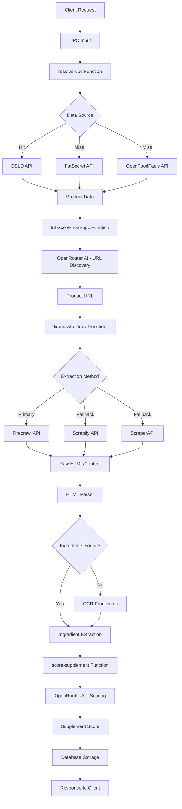

# 🧬 Supplement Score Pipeline

[](https://github.com/Nickan17/suppcodex/actions/workflows/onboarding.yml)

A production-ready TypeScript/Deno pipeline for supplement label extraction, enrichment, and AI-powered scoring. Built on Supabase Edge Functions with multi-provider web scraping, OCR, and LLM integration.

## 🏗️ Architecture Overview



## 🚀 Quick Start

### Prerequisites

- [Node.js 18+](https://nodejs.org/)
- [Deno 1.40+](https://deno.land/manual/getting_started/installation)
- [Supabase CLI](https://supabase.com/docs/guides/cli/getting-started)
- Git

### 1. Initial Setup

```bash
# Clone the repository
git clone <repository-url>
cd suppcodex

# Install dependencies
npm install

# Install Supabase CLI (if not already installed)
npm install -g @supabase/supabase-js

# Authenticate with Supabase
supabase login
```

### 2. Environment Configuration

```bash
# Copy environment template
cp .env.example .env.local

# Edit with your API keys (see API Keys section below)
# Minimum required variables:
# - SUPABASE_URL
# - SUPABASE_ANON_KEY
# - SUPABASE_SERVICE_ROLE_KEY
# - OPENROUTER_API_KEY
# - SCRAPFLY_API_KEY
```

### 3. Deploy & Test

```bash
# Build and deploy edge functions
npm run deploy:dev

# Run the pipeline test
npm run test:pipeline

# View function logs
npm run logs
```

## 🔑 API Keys Required

### Required (Core Functionality)
- **Supabase**: [Dashboard](https://app.supabase.com/) → Project Settings → API
- **OpenRouter**: [Platform](https://openrouter.ai/) → API Keys (for LLM scoring)
- **Scrapfly**: [Dashboard](https://scrapfly.io/) → API Keys (web scraping)

### Optional (Enhanced Features)
- **Firecrawl**: [Platform](https://firecrawl.dev/) → API Keys (primary web scraping)
- **OCR.space**: [Platform](https://ocr.space/ocrapi) → API Keys (ingredient label OCR)
- **DSLD**: [NIH Database](https://api.ods.od.nih.gov/) → API Keys (supplement database)
- **FatSecret**: [Platform](https://platform.fatsecret.com/) → OAuth credentials

## 📁 Project Structure

```
.
├── app/                      # React Native/Expo frontend
├── supabase/
│   ├── functions/           # Edge Functions (Deno)
│   │   ├── _shared/        # Shared utilities & types
│   │   │   ├── env-validation.ts    # Environment validation
│   │   │   ├── config.ts           # Constants & configuration
│   │   │   ├── utils.ts            # Shared utilities
│   │   │   ├── types.ts            # TypeScript interfaces
│   │   │   └── fatsecret.ts        # FatSecret API integration
│   │   ├── resolve-upc/    # UPC → Product data resolution
│   │   ├── firecrawl-extract/      # Web scraping & content extraction
│   │   ├── score-supplement/       # AI-powered scoring
│   │   ├── full-score-from-upc/    # Complete pipeline orchestration
│   │   └── process-upc/    # Alternative processing pipeline
│   ├── config.toml         # Supabase configuration
│   └── deno.json          # Deno configuration
├── components/             # React Native UI components
├── __tests__/             # Test files
└── coverage/              # Test coverage reports
```

## 🛠️ Development Workflow

### Local Development

```bash
# Start development with file watching
npm run dev

# Run tests
npm test
npm run test:coverage

# Code quality
npm run lint
npm run type-check

# Format code
npm run fmt
```

### Function Development

```bash
# Work in Supabase functions directory
cd supabase

# Test specific function locally
deno run --allow-all functions/resolve-upc/index.ts

# Deploy single function
supabase functions deploy resolve-upc

# View function logs
supabase functions log resolve-upc
```

### Testing Pipeline

```bash
# Test complete UPC-to-score pipeline
./test_full_score.ps1 850017020276

# Test specific components
curl -X POST "http://localhost:54321/functions/v1/resolve-upc" \
  -H "Content-Type: application/json" \
  -d '{"upc": "850017020276"}'
```

## 🧪 Edge Functions Guide

### 1. resolve-upc
Resolves UPC codes to product data using multiple APIs.

**Input**: `{"upc": "850017020276"}`
**Output**: Product metadata with ingredients, brand, name
**Fallback Chain**: DSLD → FatSecret → OpenFoodFacts

### 2. firecrawl-extract  
Extracts content from product URLs with multiple scraping providers.

**Input**: `{"url": "https://product-page.com"}`
**Output**: Raw HTML + parsed ingredients with dosage detection
**Fallback Chain**: Firecrawl Extract → Firecrawl Crawl → Scrapfly → ScraperAPI → OCR

### 3. score-supplement
AI-powered supplement scoring using extracted product data.

**Input**: Parsed product data from firecrawl-extract
**Output**: 0-100 score with detailed breakdown and justification
**Model**: GPT-4o-mini via OpenRouter

### 4. full-score-from-upc
Complete pipeline orchestrating all functions for UPC-to-score flow.

**Input**: `{"upc": "850017020276"}`
**Output**: Complete supplement score with metadata
**Flow**: resolve-upc → URL discovery → firecrawl-extract → score-supplement

## 🚨 Troubleshooting

### Common Issues

#### Environment Variables Not Set
```bash
# Check function logs
supabase functions log <function-name>

# Look for validation errors:
# "❌ Environment Validation Failed"
```

#### Rate Limiting
Functions include built-in rate limiting (5 req/min per IP). For development:
```typescript
// Temporarily increase in _shared/config.ts
MAX_REQUESTS_PER_MINUTE: 50  // for development only
```

#### OCR Not Working
- Verify OCRSPACE_API_KEY is set
- Check image accessibility (some sites block OCR services)
- Review OCR logs for E214 errors (image too large)

#### Scraping Failures
1. **Firecrawl fails**: Falls back to Scrapfly automatically
2. **All scrapers fail**: Check if site blocks automation
3. **No ingredients found**: May trigger OCR fallback

### Debugging Tools

```bash
# Enable detailed logging (set in environment)
DEBUG=true

# Check function performance
npm run logs | grep "timing"

# Monitor API usage
# Check respective API dashboards for rate limits/usage
```

## 📊 Performance & Scaling

### Response Times (Typical)
- **resolve-upc**: 200-500ms per API call
- **firecrawl-extract**: 2-10s depending on complexity
- **score-supplement**: 1-3s for LLM processing
- **full-score-from-upc**: 5-15s end-to-end

### Rate Limits
- Built-in: 5 requests/minute per IP (configurable)
- External APIs have their own limits (check respective documentation)

### Scaling Considerations
- Functions auto-scale with Supabase Edge Functions
- Database connections pooled automatically
- Consider upgrading API plans for production volume

## 🔒 Security

### Environment Variables
- All sensitive data stored in environment variables
- No hardcoded API keys or secrets
- Fail-fast validation prevents deployment with missing config

### API Security
- CORS configured for controlled origins
- Rate limiting prevents abuse
- Input validation on all endpoints

### Data Privacy
- No PII stored in logs
- Scraped content not permanently stored
- API responses include no user-identifying information

## 📈 Monitoring & Observability

### Logs
```bash
# Real-time function logs
npm run logs

# Filter by function
supabase functions log resolve-upc

# Search logs
supabase functions log | grep "ERROR"
```

### Metrics
- Function execution times logged automatically
- API success/failure rates tracked
- Rate limiting events logged

### Health Checks
```bash
# Test all functions
npm run test:health

# Individual function health
curl -X POST "https://your-project.supabase.co/functions/v1/resolve-upc" \
  -H "Authorization: Bearer $SUPABASE_ANON_KEY" \
  -d '{"upc": "test"}'
```

## 🤝 Contributing

### Code Standards
- TypeScript strict mode enabled
- ESLint + Prettier for formatting
- Comprehensive error handling required
- All functions must validate environment at startup

### Testing Requirements
- Unit tests for all utility functions
- Integration tests for complete flows
- Minimum 80% code coverage
- All tests must pass before deployment

### Pull Request Process
1. Create feature branch from `main`
2. Implement changes with tests
3. Run full test suite: `npm run test:all`
4. Update documentation if needed
5. Submit PR with detailed description

## 📝 License

[Add your license information here]

## 🆘 Support

- **Issues**: [GitHub Issues](https://github.com/your-repo/issues)
- **Discussions**: [GitHub Discussions](https://github.com/your-repo/discussions)
- **Documentation**: This README and inline code comments
## 🎨 UI & Styling

### Utility Classes
The project uses Tailwind CSS with custom brand tokens. Available utility classes include:
- **Colors**: `bg-blue-500`, `text-gray-900`, `border-red-200`
- **Spacing**: `p-4`, `m-2`, `gap-6` (4px increments)
- **Z-index**: `z-card`, `z-modal`, `z-tooltip`
- **Theme-aware**: Colors automatically adapt to light/dark mode

### Theme System
- `ui/theme.ts`: Light/dark palettes and design tokens
- `hooks/useTheme.ts`: React hook for theme-aware styling
- `tailwind.config.js`: Tailwind configuration with brand colors

### Storybook
Storybook runs on-device in Expo development mode. Launch the app in development mode to see Storybook UI with StatusChip and SupplementFactsTable stories.

**Note:** Expo/React Native Storybook runs only in-app, not in browser.

## 🚫 Scrape Policy

Some brands (e.g., Optimum Nutrition) aggressively block all automated scraping. These are marked `blocked_by_site` (HTTP 451), excluded from automated E2E success rates, and handled manually or via partner APIs. We auto-skip blocked domains in nightly runs and surface a `_meta.remediation` for product/ops triage.

### Domain Blocklist

- **optimumnutrition.com**: All scraping attempts blocked by site; manual SKU handling required

### Remediation Status Codes

- `success`: Full extraction completed (title + ingredients + supplement facts)
- `parser_fail`: HTML retrieved but extraction incomplete; needs site-specific parser
- `provider_error`: Network/API issues; may need key rotation or provider switch
- `blocked_by_site`: Domain blocks all bots; requires manual handling
- `dead_url`: 404 errors; URL needs updating
